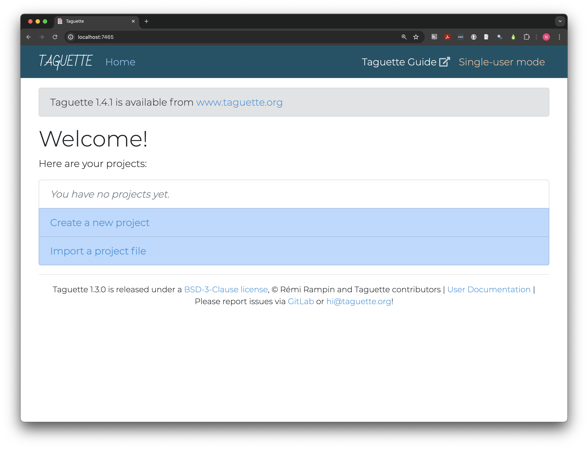
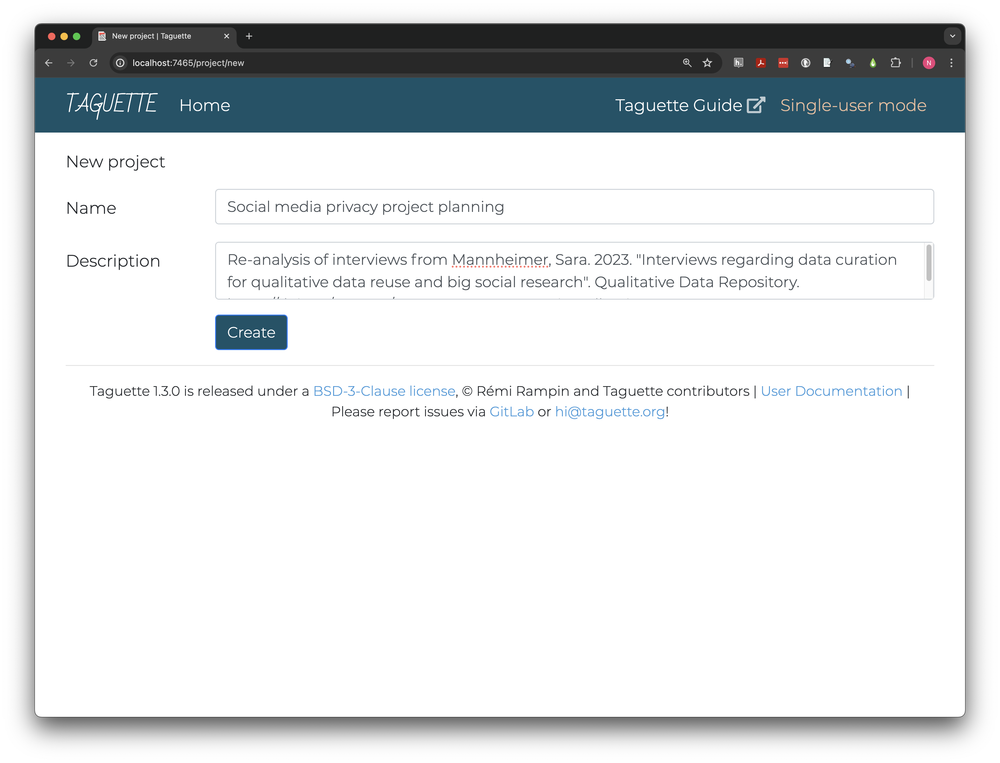
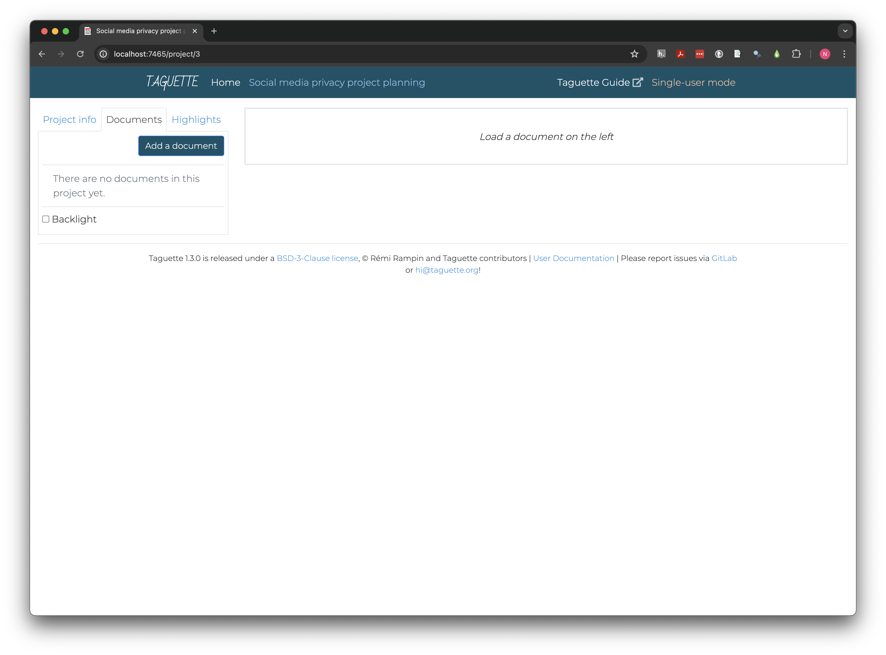
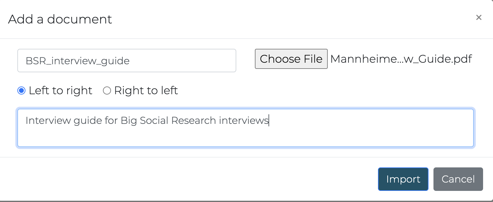

::: questions

-   How are projects organized in Taguette?
-   What limitations are there on documents in Taguette?

:::

::: objectives

-   Create a Taguette project and import documents
-   Apply consistent naming conventions to project documents

:::

Once we have a general sense of the data we'll be using and what format it needs to be in, the next step is generally to create a project in a qualitative software package and import the de-identified raw data.

::: spoiler

### Qualitative software

Qualitative software is sometimes called **CAQDAS**, an acronym for *Coding and Qualitative Data Analysis Software* to recognize the two essential functions of qualitative research software:

1. Apply codes or tags systematically to a collection of data sources
2. Analyze codes (and sometimes raw data or secondary sources) to draw conclusions

CAQDAS have various features that may be useful for particular types of data or methodologies. This lesson includes an [alternative software options page](../learners/alternative-software-options.html) for those interested in learning about other CAQDAS.

:::

[Taguette][taguette_homepage] is an open-source and cross-platform tool for basic coding and analysis of textual data. It is free and can be installed on your own computer or used online with [Taguette cloud][taguette_cloud].

## Starting Taguette

If you haven't already installed Taguette, please follow the instructions in [Summary and Setup][../index.html] before proceeding.

When you first open Taguette, there may be a short delay and you may see a text window open (you can ignore this for now) then a new tab will open in your default browser that looks something like the image below.

{alt="Image of the launch screen for Taguette in a browser window"}

::: instructor

### Taguette versions

[Taguette Cloud][taguette_cloud] users will need to create an account and login and may also notice some differences in the launch page. Instead of `localhost:####` their address bar will read `app.taguette.org`. Additionally, where `Single-user mode` is highlighted on the local version, there will be an `Account` dropdown menu at the top right and the welcome will show their username.

Users may also notice banners on one or both versions, and, if they have already created projects, those will appear as a list in the table.

If learners using the local version have questions, instructors may wish to explain that the text window is essentially creating a temporary web application that is run entirely on their computer without sending any data to the internet.

In the future, callouts with persistent tab selection may be used to allow lesson users to automatically see relevant screenshots and discussion for their version of the software. If you would like to contribute to this project, please contact the lesson maintainers.

:::

## Creating a project

Work in Taguette is organized in projects, each of which contain their own sets of *documents*, *tags*, and *highlights*. Click `Create a new project` and give it a clear name like `Social media privacy project planning`. Descriptions are not required but can be invaluable in finding the right project and documenting sources. Because we're re-using archival data, document the data source in the `Description` field.

{alt="Image of New project screen in Taguette for a project named Social media privacy project planning. The description includes a citation to the data at QDR."}

Clicking `Create` takes us to the project page, where all our interactions with the project will take place from now on. The left pane contains tabs to view or edit `Project info`, import or navigate `Documents`, and create or view `Highlights`. The right pane will display documents and highlights.

{alt="Image of project page for a new project in Taguette with the Documents tab selected but no documents displayed"}

## Importing and navigating documents

Documents can be imported one at a time with the `Add a document` button in the `Documents` tab of the left pane. The first document you may want to add is the interview guide.

{alt="Image of Add a document dialog in Taguette with a sample file selected"}

Once the document is imported, open it by clicking its title on the left.

Semi-structured interview guides often include both main questions like **Did you publish any of the data from your example?** and planned follow-up probes meant for when the participant doesn't volunteer as much information as the interviewer is seeking. For the question above, there are three probes to learn more about data publication (about 2/3 of the way down the document):

1. Is the data published in a repository? Which one?
2. What are your plans for storing, retaining, and deleting data in the future?
3. Who has access to the data?

::: callout

### Format limitations

Taguette can only import a limited number of the most common types of text documents, including `.pdf`, `.docx`, `.txt`, `.odt`, `.md`, and `.html` files. Images and most formatting will also be stripped when documents are imported.

Scrolling through the interview guide for example, it looks like outline levels and section headers were flattened and a `Document Outline` based on formatting in the original `pdf` was added.

:::

::: challenge

### Adding more documents

On your own, find and add each of the `Big Social Research` interview transcripts from the Mannheimer project. Make sure to use short, clear, consistently structured names to make it easy to navigate between documents.

::: hint

This project already uses a sequence of numbers to distinguish respondents without using names. One simple naming convention is `BSR_##`, where number is the respondent number (i.e. `BSR_01`). Some interview numbers may be missing; the readme file states why: "Two participants declined to have their data shared."

:::

Documents cannot be created or edited in Taguette. Any changes, including the removal [personally identifiable information](https://en.wikipedia.org/wiki/Personal_data) from data that will be shared, must take place before they are added to the project.

:::

::: keypoints

- Taguette's interface has two main sections, a left pane for navigating, and a right pane for viewing
- Documents should be cleaned and anonymized, if needed, before adding to a Taguette project
- Consistent document naming conventions make projects easier to navigate

:::
